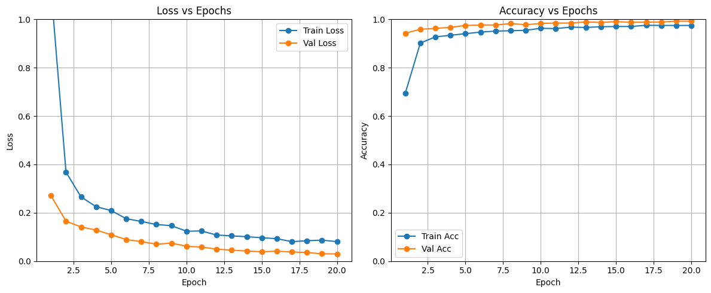
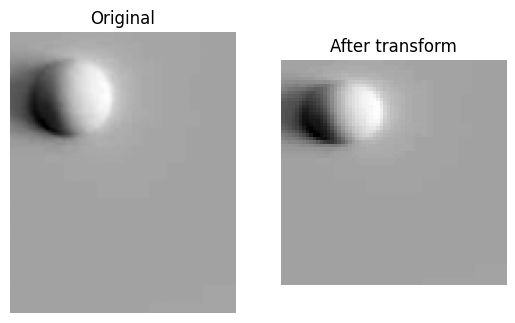
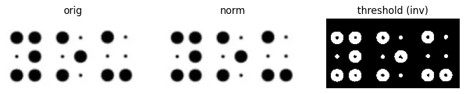
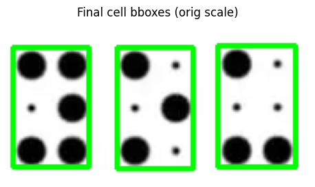
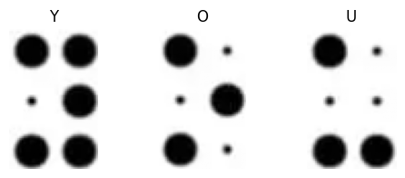

# 👁️ Braille Alphabet Classification using CNN

This project is a deep learning–based Braille alphabet recognition system built using a Convolutional Neural Network (CNN).  
The goal is to classify Braille symbols (non-4-dotted alphabets) and convert them into readable English text — enabling word-level recognition.

---

## 🚀 Features
- ✔️ CNN-based model trained from scratch  
- ✔️ High training & validation accuracy  
- ✔️ Supports only valid Braille alphabet patterns to ensure correct word formation  
- ✔️ Clean dataset preprocessing pipeline  
- ✔️ Confusion matrix, classification report & model evaluation included  
- ✔️ Ready for deployment / API integration  

---

## 🧠 Model Architecture
- Convolution layers  
- MaxPooling  
- Dropout for regularization  
- Fully connected layers  
- Softmax output for multi-class classification  

Training was done on a custom Braille dataset.

---

## 🔧 Installation
Clone the repository:

```bash
git clone https://github.com/<your-username>/<repo-name>.git
cd <repo-name>
```
---

## 📁 Project Structure

├── braille_proj.ipynb  # Training notebook

├── braille_cnn_best.pth

└── requirements.txt

└── README.md

---

## 📊 Evaluation

- High accuracy on both training and validation sets

- Confusion matrix & classification report generated

- Model generalizes well across unseen Braille patterns

-  **Training Accuracy:** ~99%  
- **Validation Accuracy:** ~99%  
- **Generalization:** No overfitting (curves stable and close)   

<p align="center">
  
</p>

---

## 📦 Image transformation before and after training

<p align="center">
  
</p>

---

## 📤 Output

<p align="center">
  
</p>

<p align="center">
  
</p>

<p align="center">
  
</p>

---
 ## 👨‍💻 Author

Abhijith Babu
Passionate about ML & AI 🚀

📌 GitHub: [https://github.com/AbhijithBabu12]

📌 LinkedIn: [https://www.linkedin.com/in/abhijith-babu-856170201/]


